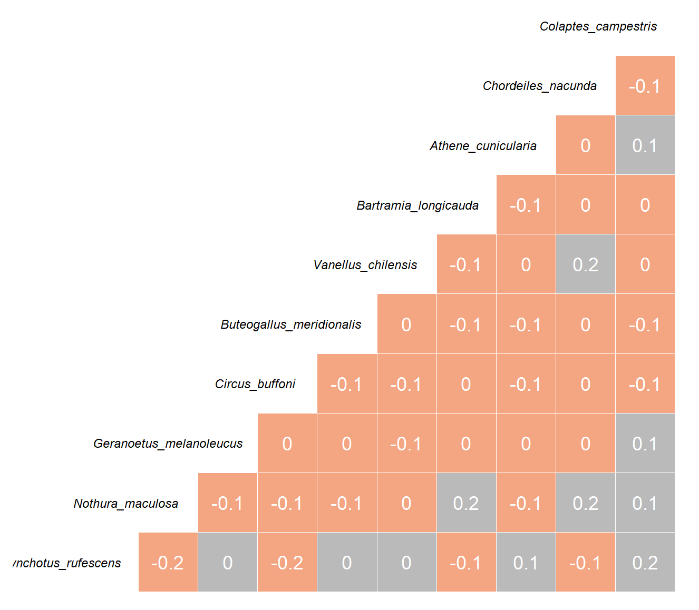
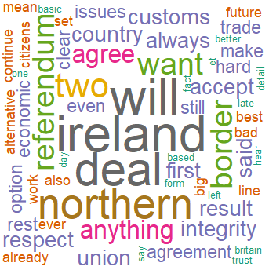

###Using ggplot2
  

The ggplot is a package with a simple but versatile language that allows you to display some beautiful graphics and statistical analyses that are easy to customize.

<a href=ggplot.html class="btn btn-success">View Project</a>  
  
 
 
 
 

###Multivariate analyses
  
  
Multivariate analyses are a great way to explore data but by no means is the only practical one. Each multivariate analysis has its nuance in how they "interpret" data and how they analyze it. It all depends on the question or objective and the nature of the dataset.  
  
<a href=multivariate.html class="btn btn-success">View Project</a>  
  
 
 
 
 

###Maps###
  
  
Making maps in statistical analyse will enable to display results of sentiment analyses in a region, ecological surveys related to geographical features, and much more. I made several maps with bathymetry data, and fish catch data.  
  
<a href=maps.html class="btn btn-success">View Project</a>  
  
 
 
 
 

###Text Mining, Sentiment Analysis, Survey Analysis###
  
  
One thing I have endeavoured outside of my career in the Biological Sciences is Communication, Science Communication and Multilingualism. I am fascinated how we humans relate to one another to the world arounds us and to each other and how language plays a role in this interaction. Following this yearning, I did a short sentiment analysis of a speech and a word map as well and have collaborated on a couple of researches so far. 
  
<a href=sentiment.html class="btn btn-success">View Project</a>  

 
 
 
 
